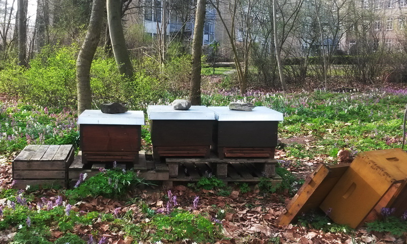
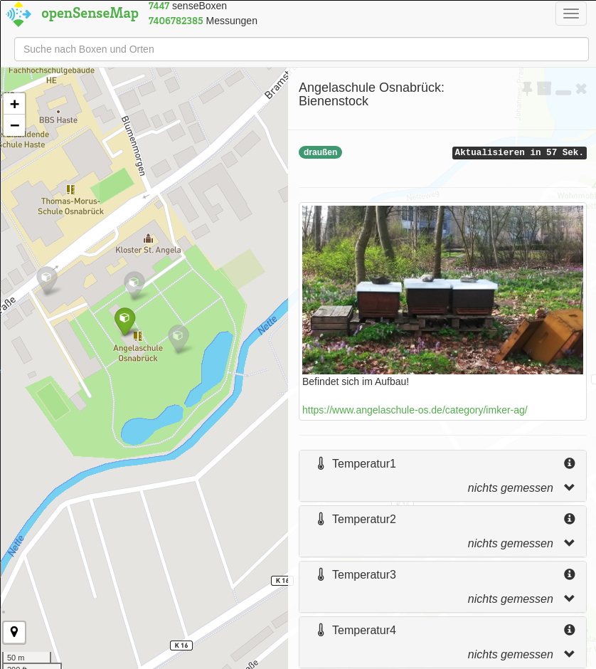
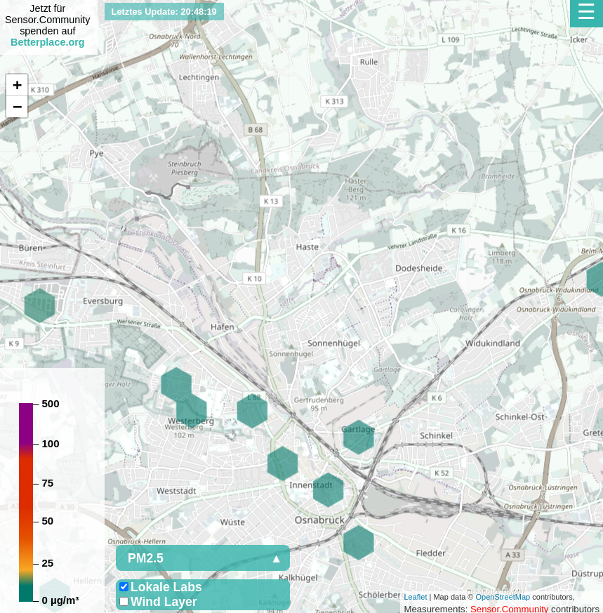
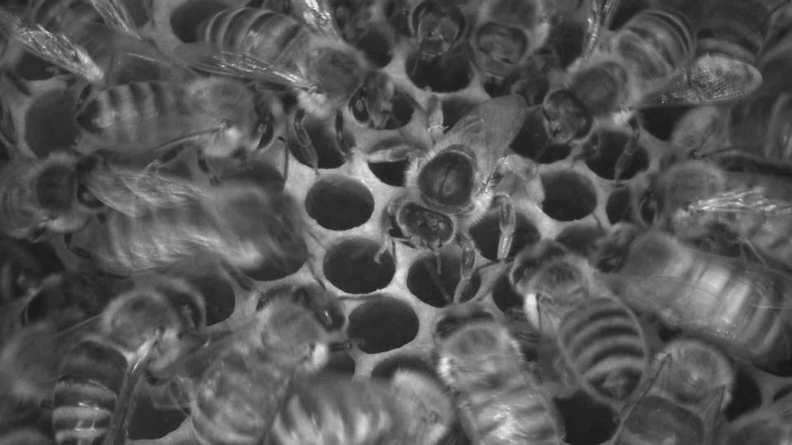
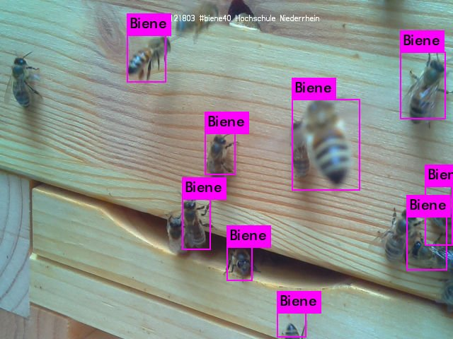
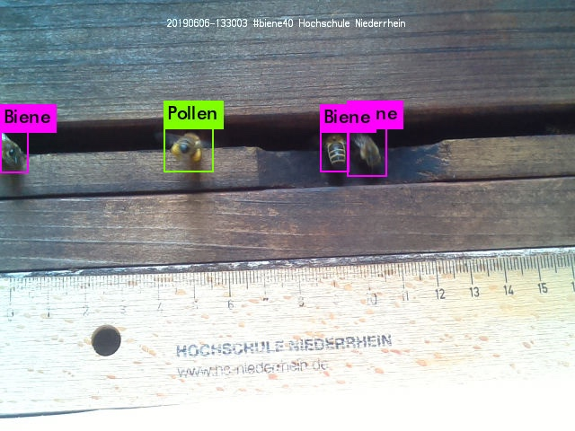
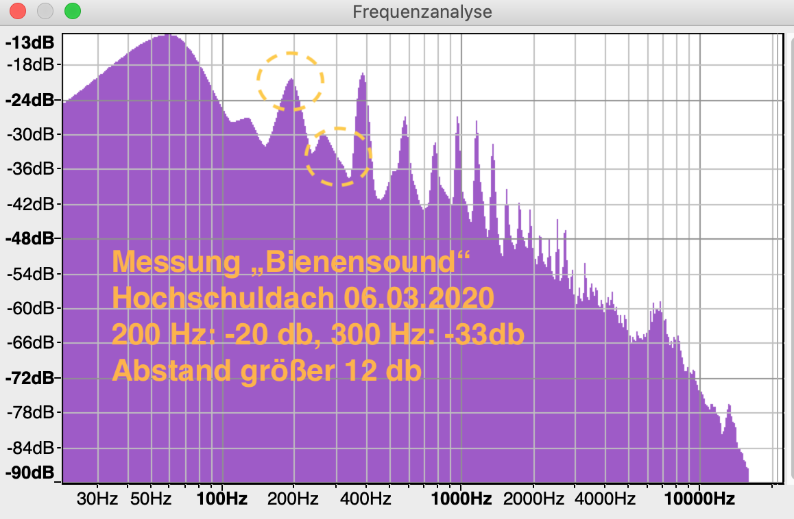
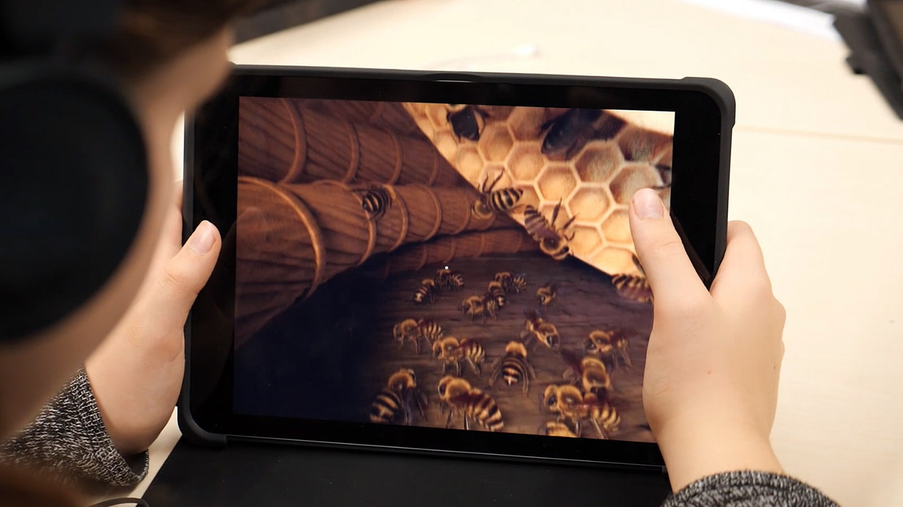

# Unser digitaler 🐝-stock (Projektskizze)

Unsere Projektskizze ist lizenziert unter [CC BY-SA 4.0](https://creativecommons.org/licenses/by-sa/4.0/deed.de).

- [Unser digitaler 🐝-stock (Projektskizze)](#unser-digitaler--stock-projektskizze)
  - [Über unsere Bienen](#über-unsere-bienen)
  - [Anlass und Ziele](#anlass-und-ziele)
  - [Zielgruppe](#zielgruppe)
  - [Fahrplan](#fahrplan)
  - [Überblick über die geförderten Themen](#überblick-über-die-geförderten-themen)
  - [Thema: LoRaWAN und Sensorik](#thema-lorawan-und-sensorik)
  - [Thema: Wetter- und Umweltdaten außerhalb des Bienenstocks](#thema-wetter--und-umweltdaten-außerhalb-des-bienenstocks)
  - [Thema: Luftqualität außerhalb des Bienenstocks](#thema-luftqualität-außerhalb-des-bienenstocks)
  - [Thema: Lärmbelastung](#thema-lärmbelastung)
  - [Thema: Videografie](#thema-videografie)
  - [Thema: Videografie und KI](#thema-videografie-und-ki)
  - [Thema: Soundbewertung](#thema-soundbewertung)
  - [Thema: VR / Einen virtuellen Bienenstock entdecken](#thema-vr--einen-virtuellen-bienenstock-entdecken)
  - [Wortwolke / Tag Cloud](#wortwolke--tag-cloud)

## Über unsere Bienen

Sechs Carnica-Bienenvölker bestehend aus ca. 20.000 Tieren:

- Circus maximus
- Honeybee home
- Honey cube
- Goldmine
- Carnica castle
- Goldrausch

Die Holz-Magazinbeuten sind ca. 1cm breiter als Deutsch-Normal-Maß (DNM) und
doppelwandige (damit die Bienen im Winter besser geschützt sind).

Ab Februar ist die Winterpause bei unseren Bienen vorbei. Am Besten lässt
sich mit den Bienenstöcker um die Mittagszeit arbeiten, denn dann haben die
meisten unsere Bienen ihre aktive Phase. Daher findet unsere Imker-AG
meistens auch in der Mittagszeit ( in der 7. und 8. Stunde (13:00-14:45 Uhr))
statt.

Mehr Informationen:
<https://www.angelaschule-os.de/category/imker-ag/>

## Anlass und Ziele

> Digitaler Schutz unserer Schulbienen und trotz Distanz im digitalen
Gedächtnis der Schülerinnen und Schüler bleiben.

Wir haben uns überlegt, wie wir den Schülerinnen und Schüler trotz
Distanzlernen und dem Fernbleiben der Schule die "Nähe" zu den Schulbienen
erhalten können. Wir hoffen, das neben den anderen Vorteilen die
Digitalisierung eines Bienenstock bietet, vor allem auch das Sorgen, Kümmern
und Interesse unsere Schülerinnen und Schüler erhalten bleibt und vielleicht
sogar gestärkt wirkt - trotz Distanz -.

Die Themen können in Kooperationen mit Akteure unser Region und Kommune oder
in anderen Regionen und Kommunen umgesetzt werden. Dazu gehören Unternehmen
der gewerblichen Wirtschaft, Hochschulen, Forschungseinrichtungen, Verbänden,
Vereinen, ­Stiftungen, kommunalen Wirtschaftsverbänden, Bildungsträgern,
Gebietskörperschaften, Kommunalverbänden und Körperschaften des öffentlichen
Rechts zum Zwecke des Aufbaus und der Bereitstellung von Strukturen für
regelmäßige und betreute Angebot für unsere Schülerinnen und Schüler ob in
Präsenz oder Distanz. Schulisch oder Außerschulisch.

## Zielgruppe

Zur Zeit interessieren sich hauptsächlich Schülerinnen und Schüler aus den
**Jahrgängen 5 bis 8** für die Imker AG.

Wir hoffen das wir mit dem Projekt auch Schülerinnen und Schüler der Jahrgänge
9 bis 13 ansprechen, sowie aufgrund der vielseitigen digitalen Themen auch
Kolleginnen und Kollegen andere Fachbereiche wie Physik, Informatik, Chemie,
Erdkunde (wegen Wetter und Klima), Musik (Soundanalyse) und Kunst.

Wir denken, dass die digitalen Themen für alle Jahrgänge interessant sein
könnten.

Darüber hinaus streben wir die Teilnahme an den Schüler- und
Jugendwettbewerben, `Schüler experimentieren` für die 4. Klasse bis 14 Jahre)
und `Jugend forscht` ab 15. Jahre (9. Klasse), an.

Weiter Infos zu den Schülerwettbewerben:

- <https://www.jugend-forscht.de/teilnahme/alterssparten/schueler-experimentieren.html>
- <https://www.jugend-forscht.de/teilnahme/alterssparten/jugend-forscht.html>

## Fahrplan

- Themen sammeln (DONE)
- Interne Projektskizze und -vorstellung (DONE)
- Suche nach Finanzierungsmöglichkeiten für die einzelnen Themen (WIP)
- Informationen zu den Themen sammeln (WIP)
- Forschungstagebuch anlegen
- Optional: Vorstellung des Projektes und der Themen
  - <https://www.osnabrueck.de/bienenbuendnis/>
  - <http://www.xn--imkerverein-osnabrck-6ec.de/>
  - <http://www.imker-weser-ems.de/>
- Optional: Teilnahme an `Schüler experimentieren`
  - Anmeldung bis zum 30.11.2021
  - Erstellung einer schriftlich Arbeit bis Januar 2022
  - <https://www.jugend-forscht.de/fileadmin/user_upload/Downloadcenter/Infomaterial/Faltblatt_Schueler_experimentieren.pdf>
- Optional: Teilnahme an `Jugend forscht`
  - Anmeldung bis zum 30.11.2021
  - Erstellung einer schriftlich Arbeit bis Januar 2022
  - <https://www.jugend-forscht.de/fileadmin/user_upload/Downloadcenter/Teilnahme/Teilnahmebedingungen_Jugend_forscht.pdf>

## Überblick über die geförderten Themen

| Themen | Förderung  |
| --- | :---: |
| LoRaWAN und Sensorik | 👍 |
| Wetter- und Umweltdaten außerhalb des Bienenstocks |  |
| Luftqualität außerhalb des Bienenstocks |  |
| Lärmbelastung |  |
| Videografie |  |
| Videografie und KI |  |
| Soundbewertung |  |
| VR / Einen virtuellen Bienenstock entdecken |  |

## Thema: LoRaWAN und Sensorik

Das Thema wird unterstützt von der [SWO Netz GmbH](https://www.swo-netz.de/)
und der [items GmbH](https://itemsnet.de/).

Grundlage für das Thema bildet die Abschlussarbeit von Leon Weber und der
[PRAXISBERICHT – DER DIGITALE BIENENSTOCK](https://itemsnet.de/itemsblogging/der-digitale-bienenstock/) von
Leon Weber und Marcel Linnemann.

Das Thema führt ein in das **Internet der Dinge** (IdD) (auch: „Allesnetz“;
englisch Internet of Things, Kurzform: IoT).

Wie viel Nektar und Pollen eingetragen werden oder wie schnell die
Winterfuttervorräte schwinden, das zu wissen hilft ungemein bei der
Einschätzung wie gesund und fit unsere Schulbienen sind. Hierzu wird eine
digitale **Bienestockwaage** gebaut. Grundlage hierfür ist die folgende
Anleitung: <https://hiverize.org/eine-stockwaage-bauen/>.

Zusätzlich wird die **Temperatur** im Beuteinneren gemessen (Die Behausung
allein wird Beute genannt). Die Überwachung der Temperatur des Bienenstocks
wird erfolgt durch eine selbstgebauten Lösung auf Basis von
<https://hiverize.org/einbautemperatursensor/> und der Abschlussarbeit von
Leon Weber.

Die Temperatur verrät einiges über den Zustand unseres Bienenvolkes. Da die
Temperatur nicht nur an einer Stelle gemessen wird, sondern über einige Waben
verteilt gemessen wird, ist beispielsweise die Größe des Brutnests
abschätzbar oder erkennbar, ob überhaupt Brut da ist. Das ist vor allem im
Winter sehr nützlich, wenn die Restentmilbung mit Oxalsäure ansteht. Denn
hierfür wird ein brutfreies Volk benötigt. Auch die Bewegung der Bienen in
der Beute kann durch das Temperaturprofil nachvollziehbar. Zusätzlich kann
das Temperaturprofil im Bienenstock auch ein Indikator für die vorhandene
Futtermenge sein.

Die Bienenstock-Waage und die Temperatur- und Feuchtigkeitsensoren
übermitteln die Messwerte über das **Osnabrücker LoRaWAN-Funknetz** der SWO
Netz GmbH.

*Exkurs LoRaWAN*: LoRaWAN – das WiFi für das Internet der Dinge. Mit
Reichweiten von mehreren km, keinen laufenden Übertragungskosten und einem
extrem niedrigen Energieverbrauch ist dieses Funknetzwerk bestens für das
Internet der Dinge (IoT) geeignet.

Zur internen Visualisierung der Meßwerte und Alarmierung bei der
Überschreitung von Grenzwerten werden wir ein
[Grafana](https://grafana.com/grafana/) Dashbord einsetzen.

Das Grafana Dashboard bietet zusätzlich die Möglichkeit Wetterdaten und
Wetterprognosen des Deutsche Wetterdienst (DWD) anzuzeigen. Hinweis von
[Prof. Dr. Michael Uelschen](https://www.hs-osnabrueck.de/prof-dr-ing-michael-uelschen/) Es ist
zu prüfen inweit die phänologische Daten des DWD sich in das Dashboard
integrieren lassen. Phänologische Daten bieten eine Antwort auf die Frage
"Was blüht jetzt". Dabei ist zu beachten das nicht alle Pflanzen für Bienen
interessant sind. Weiterführende Information zum [Phänologischen Kalender](https://www.nabu.de/tiere-und-pflanzen/pflanzen/pflanzenwissen/jahreszeiten.html).

Das öffentliche Bereitstellen der Meßergebnisse erfolgt über openSenseMap:
<https://opensensemap.org/explore/601ebb99e443a0001ba8be02>.

Materialliste:

- Waage (Kosten ca. 70 Euro):
  - <https://hiverize.org/eine-stockwaage-bauen/>
- LoRaWAN Sensorik (Kosten ca. 240 Euro):
  - <https://hiverize.org/einbautemperatursensor/>
  - <https://github.com/joergkeller/beehive-sensor>

Kosten geschätzt ab 300 Euro.

## Thema: Wetter- und Umweltdaten außerhalb des Bienenstocks

Außerhalb des Bienenstocks werden bereits Daten zur Außenlufttemperatur,
Außenluftfeuchte, Lichtintensität, Luftdruck und Windrichtung von der
Wetterstation der Angelaschule erhoben und an das openSenseMap-Projekt aus
Münster übertragen:
<https://opensensemap.org/explore/5f5dc63f84e5a2001b1d5dbc>

Die openSenseMap ist eine für jeden frei nutzbare Karte mit Umweltdaten.

Allerdings ist die Wetterstation aus 2006 auf dem Dach des Klassentraktes der
Angelaschule etwas in die Jahre gekommen und muss gewartet und die Sensorik
zur Windgeschwindigkeit und Niederschlag in Stand gesetzt bzw. ausgetauscht
werden.

Um den genauen Zustand zu ermitteln wurde im Januar 2021 im Rahmen des [IMAGEFILM 2021](https://www.youtube.com/watch?v=CtGE5YUU54s)
eine Drohnenbefliegung durchgeführt. Eine Analyse der Befliegung steht noch aus.

Die Meteorologische Messgeräte stammen von der [Fa. Thies.](https://www.thiesclima.com/de/),
welche Meteorologie- und Umweltmesstechnik anbietet die den Anforderung der
nationalen und internationalen Wetterdienste entsprechen. Siehe auch hierzu:
[Leitfäden für die Ausbildung im Deutschen Wetterdienst (DWD), Band 6](https://www.dwd.de/DE/leistungen/pbfb_verlag_leitfaeden/pdf_einzelbaende/leitfaden6_pdf.pdf?__blob=publicationFile&v=3).

Weitere Information über die Wetterstation der Angelaschule:
<https://github.com/angelaschule-os/wetterstation>

Geplanter Ersatz für:

- Windgeber - compact Part number: 4.3519.00.000 (Kosten neu ab ca. 400 Euro)
  - <https://www.thiesclima.com/de/Produkte/Wind-Compact/?art=147>
- Niederschlagsgeber (Kosten ab ca. 1200 Euro)
  - <https://www.thiesclima.com/de/Produkte/Niederschlag-Elektrische-Geraete/?art=746>

## Thema: Luftqualität außerhalb des Bienenstocks

Feinstaub belastet nicht nur die Gesundheit des Menschen, sondern die
Luftverschmutzung macht auch unseren Bienen zu schaffen.

Daher macht es Sinn Daten zur Luftqualität (NO2, PM2.5, PM10, Aerosol) und
Lärmbelastung nicht nur zum Schutz der Schülerinnen und Schüler zur Erfassen,
sondern auch für unsere Schulbienen. Mehr Infos:
<https://www.spektrum.de/news/luftverschmutzung-macht-bienen-zu-schaffen/1758924>

Die erfasst Daten könnten auf <https://luftdaten.info/> bereitgestellt werden:
<http://deutschland.maps.sensor.community/#14/52.2939/8.0293>

Materialliste / Hinweise auf mögliche einzusetzende Sensorik:

- <https://sensor.community/de/sensors/airrohr/>

Kosten ohne Lärmbelastung ab 250 Euro.

## Thema: Lärmbelastung

Hat Umgebungslärm (besonders in den Pausen) einen Einfluß auf die Bienen,
oder lässt dieser unsere Schulbienen unbeirrt?

<https://luftdaten.info/einfuehrung-zum-laermsensor/>

Materialliste:

- <https://sensor.community/de/sensors/dnms/>

Kosten ab 70 Euro.

## Thema: Videografie

Eine Kamera könnte den Bereich des Einflugloches aufzeichnen und die Bilder
oder den **Videostream** im Internet bereitstellen, damit unsere Schülerinnen
und Schüler jeder Zeit nach unseren Bienen "schauen" können.

Zusätzlich könnte ein **Infrarot-Video** aus dem Brutbereich der Bienen
gestreamt werden. Die Infrarot-Beleuchtung kann von den Bienen nicht
wahrgenommen werden, Infrarotlicht mit einer Wellenlänge größer 780nm ist für
sie unsichtbar.

Quelle: <https://chelifer.de/infrarot-videos-aus-dem-brutbereich-der-honigbienen/>

Software:

- <https://motion-project.github.io/>

Materialliste:

- Raspberry Pi 4 2GB (ab 50 Euro)
- Gehäuse und Lüfter(Argon One) (ab 40 Euro)
- Netzteil (ab 8 Euro)
- Powerbank mind. 5V (besser 5,1V) und mind. 10.000 mAh  (ab 15 Euro)
- USB-Kamera / Raspberry Pi Kamera V2 (ab 30 Euro)
  - Alternativ: RASP CAM HQ Raspberry Pi - Kamera, 12MP, Sony IMX477R (ab 60
  Euro) mit RPIZ CAM 16MM TO Raspberry Pi - 16mm Kameralinse, Teleobjektiv
  (ab 60 Euro)
- Infrarot-Scheinwerfer/Strahler
- Oder Kamera mit Infrarot-Strahler
- Outdoor IP65-Gehäuse  (ab 40 Euro)
  - <http://www.dg1dan.de/qo100/hardware/gehaeuse/gehaeuse.htm>

Kosten ab 190 Euro (einfache Kamera) oder 260 Euro (fortgeschrittene Kamera).

## Thema: Videografie und KI

Am Beispiel von [Prof. Dr. rer. nat. Claus Brell ](https://cbrell.de/blog/) ([Hochschule Niederrhein, Fachbereich Wirtschaftswissenschaften](https://www.hs-niederrhein.de/wirtschaftswissenschaften/personen/brell/))

Einführung in das Thema maschinelles Sehen und Erkennen.

Mit einem Einplatinen- oder einem Kleinstcomputer und einer Kamera werden
Videobilder aufgenommen. Die KI auf auf dem Einplatinencomputer oder dem
Kleinstcomputer **erkennt** und **klassifiziert** die Bilder und überträgt die
Bewertung an einen Webservice. Vorteil der **Edge-Computing**-Lösung: Es können
*schmalbandigen Netzverbindungen** (wie *LoRaWAN, TTN) zur Übertragung genutzt
werden. Die KI-Kamera liefert eine wertvolle Datenbasis.

Quellen:

- <https://www.heise.de/ratgeber/Objekterkennung-mit-Pi-Kamera-und-Edge-TPU-4475950.html>
- <https://cbrell.de/blog/honig-bienen-2020/>
- <https://cbrell.de/blog/honigbienen-2019/#bienenki>
- <https://twitter.com/clausbrell/status/1183328586473857024>
- <https://twitter.com/clausbrell/status/1160247881074401281>

Die Kamera und "Künstliche Intelligenz"  hilft beim ...

1) Bienen erkennen.

2) digitalen Bienenzählen, dem Schätzen wie starke unsere Völker sind.
3) bestimmen und zählen der Anteile von Bienen mit und ohne
Pollenhöschen.

Vor dem Flugloch ist ein Einplatinen- oder Kleinstcomputer mit Kamera montiert.
Auf dem Einplatinen- oder Kleinstcomputerläuft eine KI, die die Beinen mit und
ohne Pollenhöschen zählt. Für eine Bildanalyse werden laut Brell 29 Sekunden
benötigt.

Alle zwei Minuten nimmt der Einplatinen- oder Kleinstcomputer ein Bild auf,
archiviert und analysiert es, ermittelt die Anzahl der sichtbaren Bienen mit
und ohne Pollenhöschen und logt die Anzahlen im Internet.

Nach: <https://cbrell.de/blog/honigbienen-2019/> -> `27.08.2019 KI-Zählung der
Bienen funktioniert nach wie vor zuverlässig`

4) Erkennen von und warnen vor Feinde wie Wespen und Hornissen.

Materialliste:

- zusätzlich Edge TPU: Coral USB Accelerator (ca. 60 Euro)

Kosten zusätzlich zum Thema Videografie 60 Euro.

## Thema: Soundbewertung

Am Beispiel von [Prof. Dr. rer. nat. Claus Brell](https://cbrell.de/blog/) ([Hochschule Niederrhein, Fachbereich Wirtschaftswissenschaften](https://www.hs-niederrhein.de/wirtschaftswissenschaften/personen/brell/))

<https://cbrell.de/blog/honig-bienen-2020/> -> März -> Soundanalysen 06.03.2020

Link zur Forschungsidee von Claus Brell:

Kontinuierliche Soundanalysen können dabei helfen, heraus zu finden ob unsere
Bienen zufrieden sind. Denn Bienen produzieren Summ-Geräusche mit einem
Schwerpunkt bei einer Frequenz von 200 Hz. Sind die Bienen unzufrieden, könnte
dies an der geänderten Frequenz so um die 300 Hz erkannt werden.

Nach Rückmeldung von [Prof. Dr. Michael Uelschen](https://www.hs-osnabrueck.de/prof-dr-ing-michael-uelschen/) lässt
sich an dem Geräusch der Bienen auch erkennen, ob die Königin gestorben ist.
Weiterhin könnte es ggf. möglich sein die Wanderung der Bienen ebenfalls
mittels über die Waben verteilen Mikrofonen per Soundanalyse zu beobachten.

Mit einem Einplatinen- oder Kleinstcomputer und einem Messmikrofon werden bspw.
jede 5 Minuten 10 Sekunden lange Tonschnipsel aufgenommen. Die KI auf dem
Einplatinen- oder Kleinstcomputer bewertet den Tonschnipsel und überträgt die
Bewertung an einen Webservice. Vorteil der Edge-Computing-Lösung: es können
schmalbandigen Netzverbindungen (LoRaWAN, TTN) zur Übertragung genutzt werden.

<https://cbrell.de/blog/ki-bewertung-von-klangereignissen-bei-honigbienen/>

Natur-Soundschnipsel mit dem Raspberry Pi Zero aufnehmen:
<https://cbrell.de/blog/natur-soundschnipsel-mit-dem-raspberry-pi-zero-aufnehmen/>

Materialliste:

- Raspberry Pi Zero W (ca. 20 Euro)
- OTG Adapter (ca. 6 Euro)
- Electret Mikrofon Kapsel (ca. 1 Euro)
- einen kleinen Lautsprecher oder Kopfhörer
- Audio USB Konverter/ Adapter ab (ca. 10 Euro)
- Powerbank mind. 5000mAh (ca. 15 Euro)
- Gehäuse aus dem 3D-Drucker (ca. 10 Euro)

Kosten ab 60 Euro.

## Thema: VR / Einen virtuellen Bienenstock entdecken

Die virtuelle Realität, kurz VR, ermöglicht es unseren Schülerinnen und Schüler
das Innere des Bienenstocks zu entdecken oder auf virtuelle Erkundungstour auf
einer Wildblumenwiese zu gehen. Dabei können sie die VR-Technik kennenlernen,
entweder mit Hilfe von Tablets oder Smartphones, mit selbstgebaute VR-Brillen
aus Pappe oder Kunststoff oder spezielle VR-Brillen.

Weitere Infos und Unterrichtsmaterialien:
<https://www1.wdr.de/schule/digital/unterrichtsmaterial/bienenstock-dreisechzig-100.html>

Kosten für das Virtual-Reality-Headset [Oculus Go](https://www.oculus.com/go/) ab 350 Euro bzw. [Oculus Quest
2](https://www.oculus.com/quest-2/) ab 500 Euro.

## Wortwolke / Tag Cloud

KI /AI, Edge Computing, Soundanalyse, IoT, Makern, Computer Vision, LoraWan,
Einplatinencomputer, Kleinstcomputer (eingebettetes System), Raspberry Pi,
Tensorflow, Bilderkennung, Tensor Processing Units (TPUs), VR, Kleinstcomputer,
Embedded maschine learning
